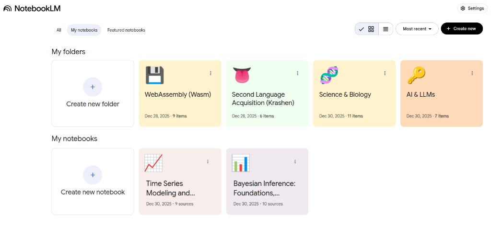
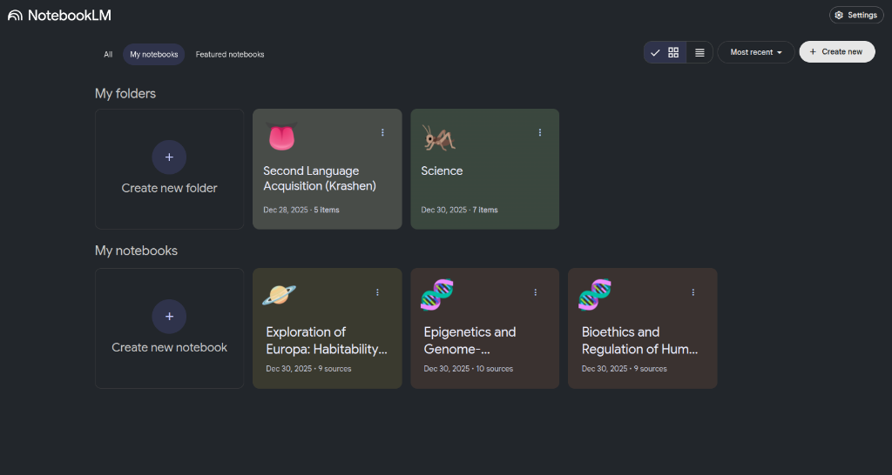
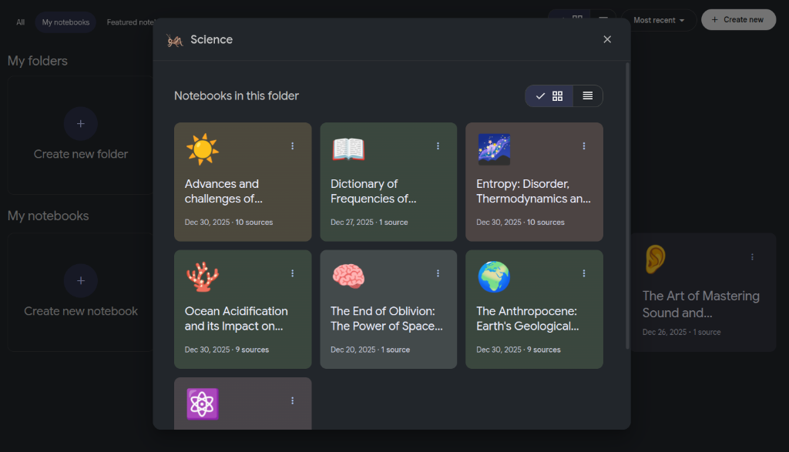
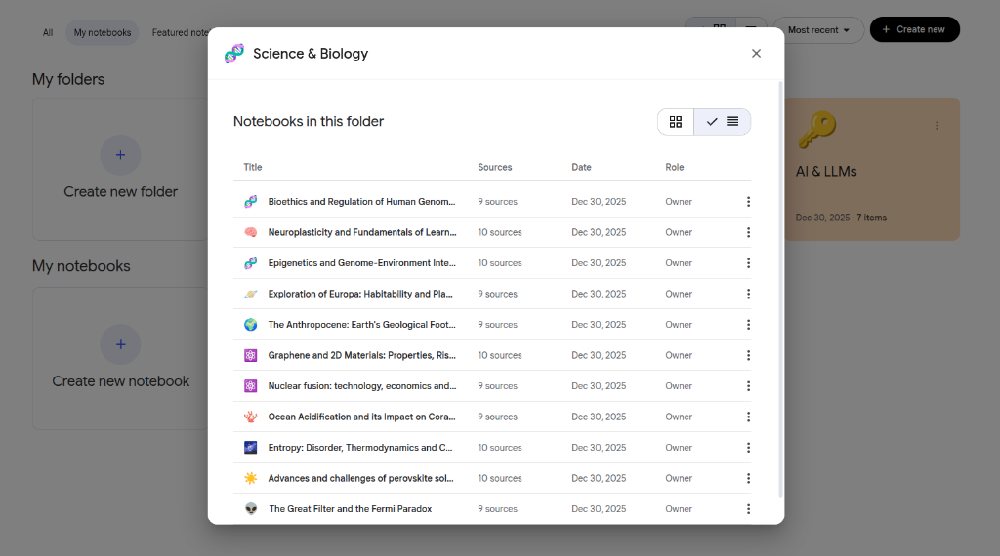
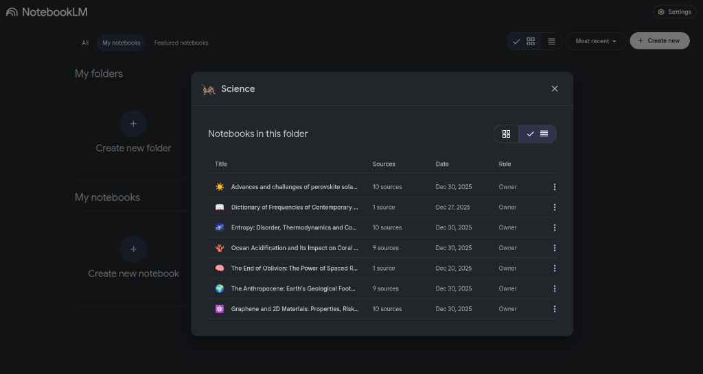
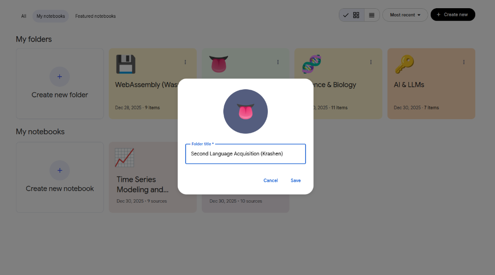
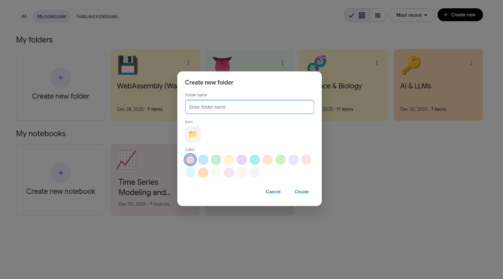

  
  <h1>foldLM</h1>
  
  

    Seamlessly integrates with NotebookLM, offering native-like aesthetics and functionality for organizing notebooks.
  

***

## Features

- **Drag and Drop**: Easily move notebooks into folders.
- **Custom Folders**: Create, rename, and delete folders to keep your workspace tidy.
- **Persisted Storage**: Your folder organization is saved automatically.
- **Emoji Support**: Add emojis to your folder names for better visual cueing.
- **Theme Support**: Automatically adapts to Light, Dark, and System themes, with a native-like layered aesthetic in dark mode.

## Screenshots

### 1. Main Interface
| Light Mode | Dark Mode |
|------------|-----------|
|  |  |

### 2. Grid View (Folder)
| Light Mode | Dark Mode |
|------------|-----------|
|  |  |

### 3. List View (Folder)
| Light Mode | Dark Mode |
|------------|-----------|
|  |  |

### 4. Edit Folder Title & Emoji

### 5. Create Folder

## Installation

1. Clone or download this repository.
2. Open Chrome and navigate to `chrome://extensions`.
3. Enable "Developer mode" in the top right corner.
4. Click "Load unpacked".
5. Select the folder containing this extension.

## Usage

Navigate to [NotebookLM](https://notebooklm.google.com/) and start dragging your notebooks into the new folder interface!

## Files

- `manifest.json`: Extension configuration.
- `content.js`: Main content script entry point.
- `folder-ui.js`: Handles the UI rendering for folders.
- `drag-drop.js`: Manages drag-and-drop interactions.
- `storage.js`: Handles data persistence.
- `emoji-picker.js`: Helper for emoji selection.
- `styles.css`: Custom styling for the extension.
- `icons/`: Contains extension icons.

## How to Update the Extension

To enjoy new updates and bug fixes without losing your created folders, follow these steps:

> [!IMPORTANT]
> **DO NOT remove the extension from Chrome.** If you remove it, all your folders and settings will be lost.

1.  **Download the New Version**: Download the ZIP file from the repository or clone the project again.
2.  **Locate Your Current Folder**: Find the folder on your computer where you have the current version of the extension saved (the one loaded in Chrome).
3.  **Overwrite Files**: Extract the contents of the new ZIP (or copy files from the new clone) and **paste them into your current folder**, accepting to replace/overwrite existing files.
4.  **Reload in Chrome**:
    *   Go to `chrome://extensions`.
    *   Find the **foldLM** card.
    *   Click the **reload** icon (circular arrow) 🔄.
5.  **Done**: Go back to the NotebookLM tab and refresh the page. Your folders will still be there, but you'll now be running the latest version.

